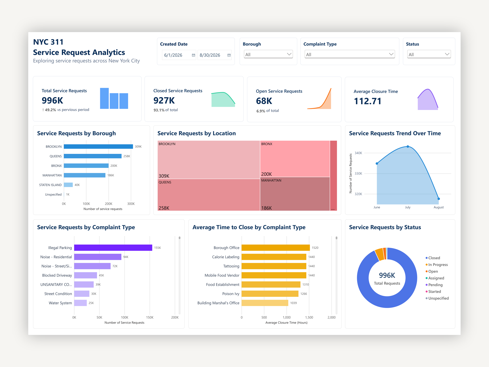

# NYC 311 Service Request Analytics

**Power BI · AWS Athena · SQL · Python**

## Project Overview

An end-to-end analysis of nearly 1 million NYC 311 service requests to identify complaint trends, geographic demand patterns, and operational performance.

**[View Live Dashboard](https://app.powerbi.com/view?r=eyJrIjoiOTUwYzcwOGUtNjI2YS00MjI0LThmZTgtMzc4ZGE0Zjg2MWQyIiwidCI6ImViZmE0ZWRhLTM3NjYtNGZjMS04ZTgyLTAyYTVkZWJjY2M5NiIsImMiOjN9)** 
## Technical Implementation

This repository contains the analytical code and dashboard development work supporting the project.
